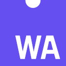

# Modern Desktop Stack
    

A playground for trying out and learning technologies that might be a good fit for a modern, high-performance desktop application technology stack. 

## 🥞 The Stack
- UI framework: Electorn
- UI technologies: Web Components, Stencil.js
- UI language: TypeScript
- Core application technologies: Rust, WASM

## 🎒 Resources
- [Electron + WASM app example](https://www.electronjs.org/apps/elcalc)
- [Electron API demos](https://github.com/electron/electron-api-demos)
- [Electron + Stencil starter](https://github.com/brunodgz/stencil-electron-st)
- [Another Electron + Stencil starter](https://github.com/edgeworkscreative/stencil-electron-app-starter)

## ℹ️ About
I am getting a first, high-level overview of some of these technologies. This means that not all my notes and comments will be accurate or complete. Also, I don't yet know whether these technologies even fit together to form a reasonable stack for desktop application development, which is why I consider this only a playground.