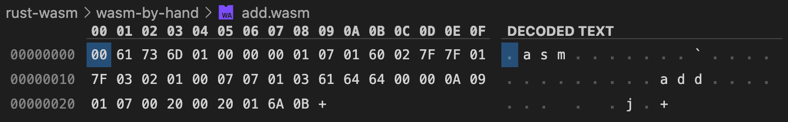

# WASM by Hand
A simple WASM example without high-level languages or build tools.

WebAssembly binaries are usually generated as a compile target for high-level languages such as Rust or C/C++. However, there is also a WebAssembly text format, `WAT`, with a 1:1 correspondence to WASM. Developing a WASM binary "by hand" like this isn't very comfortable. However, it can be a good exercise to get a better understanding of what needs to happen under the hood when we want to use Rust in a web application.

To convert between WAT and WASM, you can use the [WABT](https://github.com/webassembly/wabt) toolset.

## WABT Setup
WABT contains a set of different tools for dealing with WAT and WASM. Among them are `wat2wasm` which assembles a WAT text file into a WASM binary, and `wasm2wat` which disassembles a WASM binary into the human-readable WAT text format.

To set up WABT, you will need to build it from source. Make sure you have CMake installed (`brew install cmake` on macOS), then run the following commands (Linux / macOS; check the [repository](https://github.com/webassembly/wabt) for Windows instructions):

```bash
$ git clone --recursive https://github.com/WebAssembly/wabt
$ cd wabt
$ mkdir build
$ cd build
$ cmake ..
$ cmake --build .
```

Once the build is complete, add the `wabt/bin` directory to your $PATH variable. Verify that the setup works by running `wat2wasm --help`.

## Conceptual Overview
To implement some function of a web (or Node.js) application with WASM without using any high-level languages and build tools, we need to go through the following steps:
- Implement the function in WebAssembly text format (`.wat`)
- Assemble the `.wat` file using the `wat2wasm` tool from WABT to get a `.wasm` binary

## The Example
WAT input file: [add.wat](wasm-by-hand/add.wat)
```wat
(module
  (func $add (param $lhs i32) (param $rhs i32) (result i32)
    local.get $lhs
    local.get $rhs
    i32.add)
  (export "add" (func $add))
)
```

This WAT file defines a simple module which has and exports a single function "add". That function takes two `i32` arguments, adds them together and returns the `i32` result. A module in the text format is simply an large S-expression with a root node of type `module`. In this example, that root has two children `func` and `export`. The `func` node has its own children: two `param` nodes and a `result` node.

Looking at the first `param` node, we have the structure `(param $lhs i32)`. The `param`, as already mentioned, is the node type. The `$lhs` and `i32` parts are considered attributes to that node. Semantically, `i32` denotes the type of the param, while `$lhs` is an arbitary variable name. Note though that variable names are only a convenience and will not be part of the binary. Instead, all local variables of a function (which params are also a part of) are just 0-indexed. The only time we actually need a name is in the `"add"` string in the `export` node, because we need to define how this function should be called in JavaScript later on. Check out [add_basic.wat](add_basic.wat) for a version of this module without non-required names.

After the signature (`param` nodes and optional `result` node for non-void functions), the function node has a body, which is simply a sequential list of primitive instructions (syntactically, these are attributes to the `function` node). In this example, we first push the values of the `$lhs` and `$rhs` (or, `0` and `1`) registers onto the stack. Then, we apply the `i32.add` operation which pops two `i32` values off the stack, adds them and pushes the result. At the end of the function, we have exactly an `i32` value on the stack, which matches our declared return type. 

Finally, after the `func` block, we have the `export` block, which allows us to declare this function as being available to JavaScript under the name `add`. Once we have instantiated this module in JS, we can access this function using `instantiatedWasmModule.instance.exports.add`.

To learn more about the WAT format, check out [Understanding the WAT format](https://developer.mozilla.org/en-US/docs/WebAssembly/Understanding_the_text_format) on MDN.

To assemble the example, run `wat2wasm -o add.wasm add.wat`. Then, to test out the example, serve the current directory in a web server and go to `index.html`. That HTML file loads the `app.js` file, which fetches the `add.wasm` file, instantiates it, and exposes the `add()` function to JavaScript.

To see what the assembler did to our `add.wat` file, we can disassemble it by running `wasm2wat add.wasm`:

```
$ wasm2wat add.wasm           
(module
  (type (;0;) (func (param i32 i32) (result i32)))
  (func (;0;) (type 0) (param i32 i32) (result i32)
    local.get 0
    local.get 1
    i32.add)
  (export "add" (func 0)))
```

We can also look at the `app.wasm` binary in a hex editor:



Note that there are some differences between the original source and the disassembled code. The first thing to notice is that the variable and function names are gone, as we already explained above. At this point, I am not sure where the other differences come from, nor have I had a more detailed look at the binary format (other than the fact that the first 4 bytes are the WASM magic constant). If I get a chance, I may eventually cover this topic in more detail.